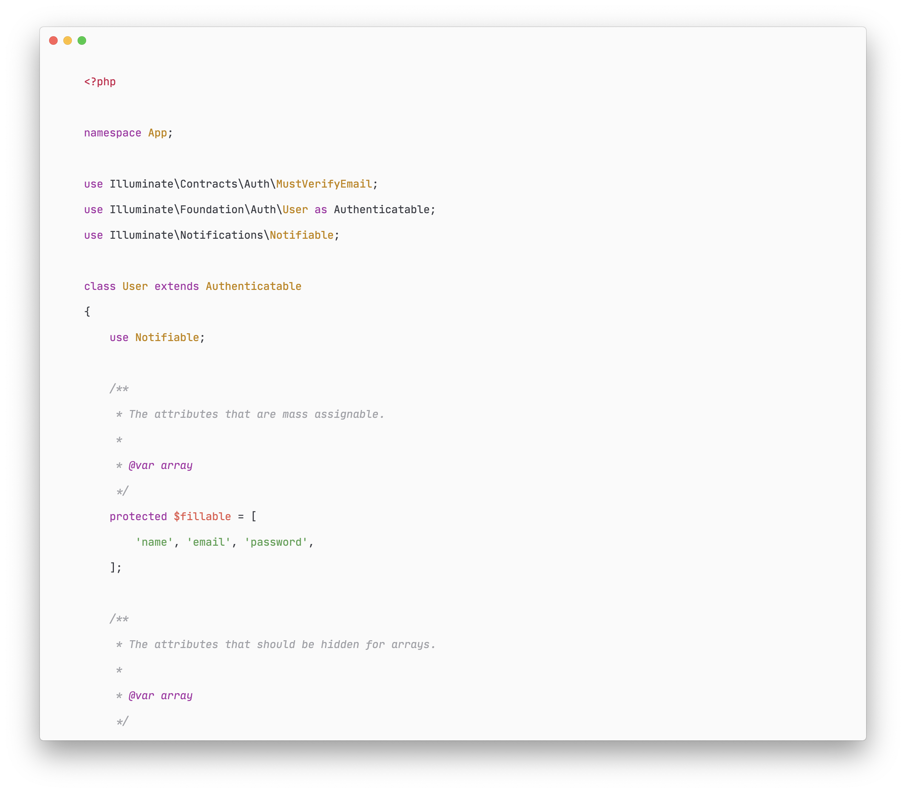

<p align="center">
  
  
</p>

# Minimal Code

Minimal Code is a set of extensions, settings and keyboard shortcuts that turns Visual Studio Code into a minimal and productive development environment.  
It's focused on minimizing distractions, reducing mouse usage and optimizing the overall workflow.

## Installation

1. Install [Visual Studio Code](https://code.visualstudio.com/Download):
   ```bash
   brew install visual-studio-code
   ```
2. Install [Apc Customize UI++](https://marketplace.visualstudio.com/items?itemName=drcika.apc-extension) extension:
   ```bash
   code --install-extension drcika.apc-extension
   ```
3. Install [GitHub Theme](https://marketplace.visualstudio.com/items?itemName=GitHub.github-vscode-theme) extension:
   ```bash
   code --install-extension github.github-vscode-theme
   ```
4. Install [JetBrains Mono](https://www.jetbrains.com/lp/mono/) font:
   ```bash
   brew tap homebrew/cask-fonts
   brew install font-jetbrains-mono
   ```
5. Copy the contents of [`src/settings.json`](src/settings.json) to your settings file (search **Preferences: Open Settings (JSON)** using the Command Palette).

## Screenshots




